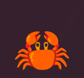
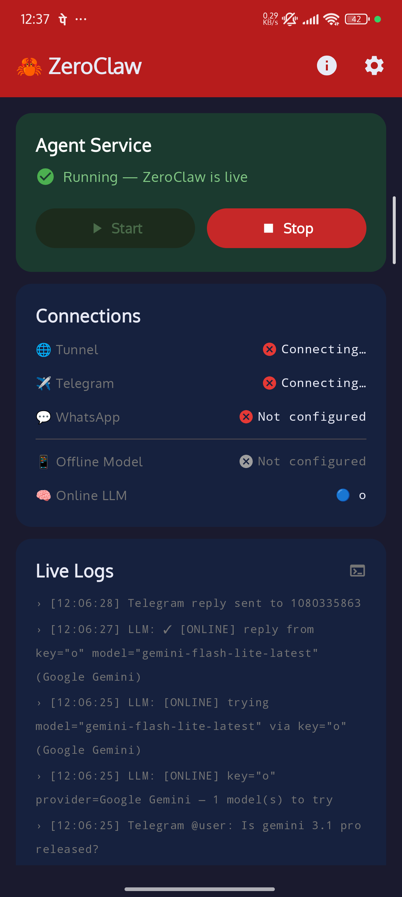
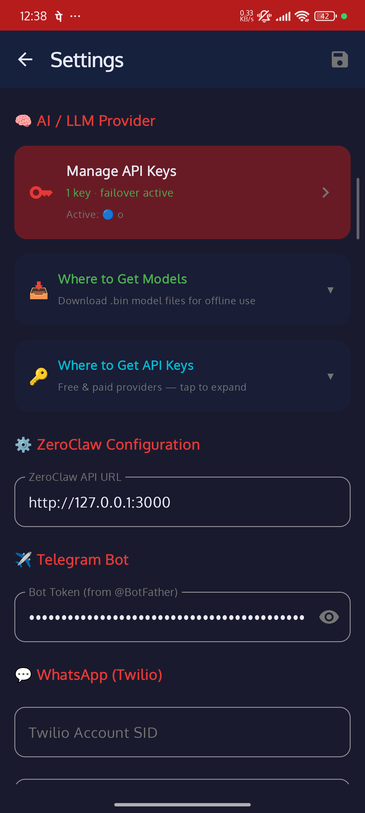
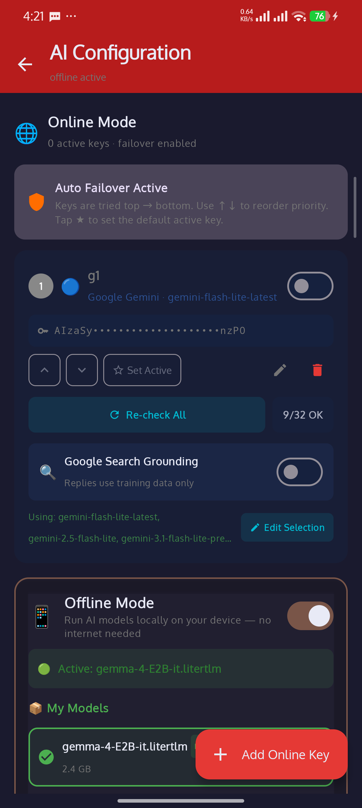
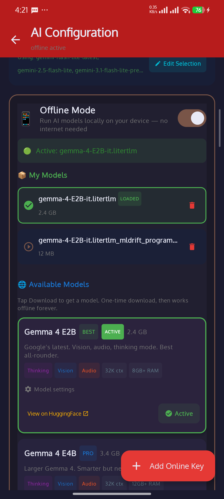
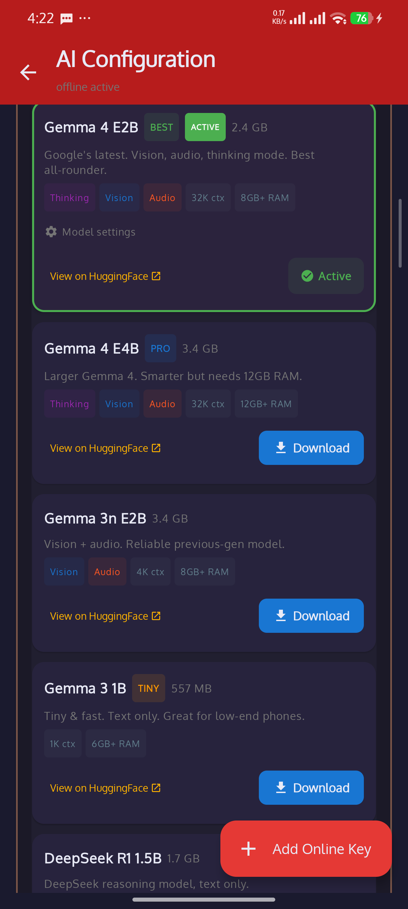
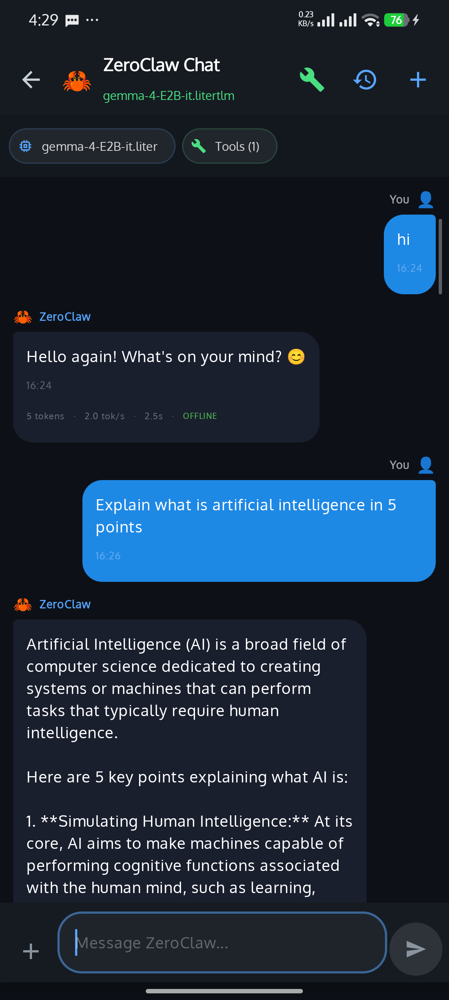
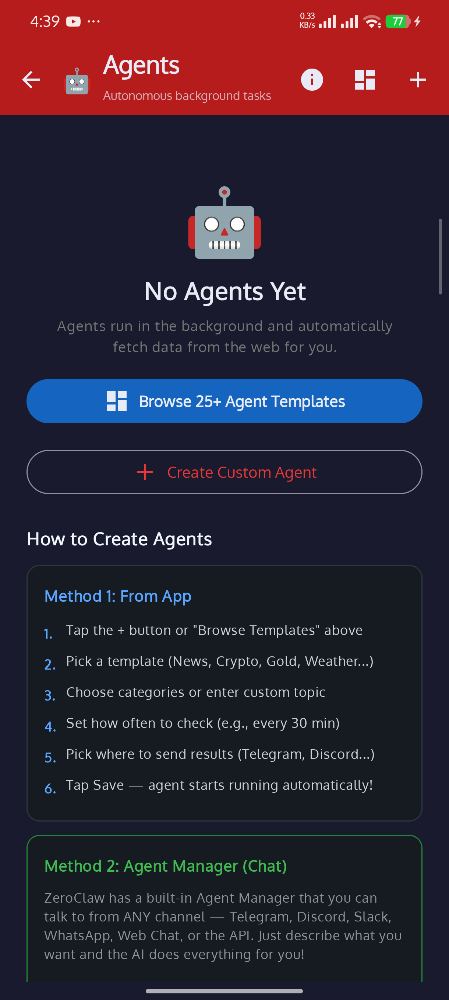
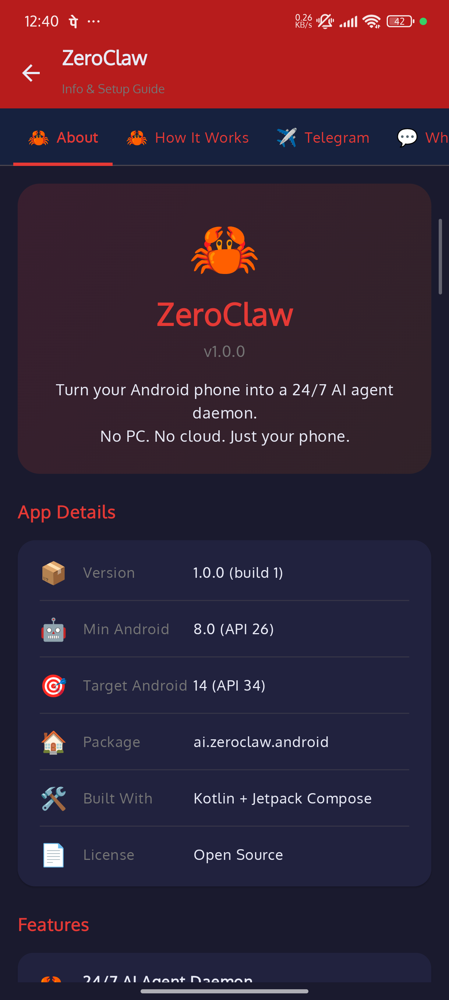

<div align="center">



# 🦀 ZeroClaw Android

### Your phone. Your AI. Always on.


<br/>

[](https://developer.android.com)
[](https://kotlinlang.org)
[](https://developer.android.com/compose)
[](LICENSE)

</div>

---

## 💡 Why This Project Exists

This is a **personal project** built out of curiosity — to see how far I can push Android as a platform for running AI agents.

> 🤔 **Can a phone run an AI service 24/7?** → Yes, with watchdog recovery and Doze awareness.
>
> 🤔 **Can it serve as an API server?** → Yes, on port 8088 — any OpenAI-compatible app can connect.
>
> 🤔 **Can it run AI offline?** → Yes, via LiteRT LM — Gemma 4 with 32K context, streaming, and thinking mode.
>
> 🤔 **Can it talk to 11 different chat platforms?** → Yes, each with its own protocol quirks.
>
> 🤔 **Can agents auto-monitor websites and push updates?** → Yes, with change detection and scheduled delivery.

Every feature started as a question like these. Many didn't work on the first try — the [BUGS.md](BUGS.md) has the full history.

I use Claude as a coding tool the same way I'd use docs or Stack Overflow — to move faster on implementation so I can focus on **architecture, debugging real device behavior, and figuring out what Android actually allows**.

---

## 🦀 What is ZeroClaw?

An Android app that runs AI **in the background 24/7**. It connects to your chat apps, gives you 30 AI tools, and lets you set up agents that automatically monitor things and send you updates. **Everything is modular** — you turn on only what you want.

```
📱 You → Pick your chat apps (Telegram / Discord / Slack / WhatsApp / ...)
                ↓
   🔧 ZeroClaw Service (runs in background)
                ↓
   🤖 AI Router → picks the best AI (Gemini, OpenAI, Anthropic, Ollama...)
                ↓
   🧰 Your enabled tools (web search, translate, image gen, RSS...)
                ↓
   ⚡ Optional add-ons:
       ├── 🕷️ Agents — auto-monitor websites & APIs, send you updates
       ├── 🧪 Playground — test any tool before using it
       ├── 🧠 Memory — AI remembers your conversations
       ├── 🔒 Security — biometric lock, audit log, rate limits
       └── 🔌 Integrations — Composio, MCP servers, A2A protocol
                ↓
   💬 Reply → your chat apps
```

---

## 📸 Screenshots

| Home | Settings | API Keys |
|------|----------|----------|
|  |  |  |

| Model Catalog (Gemma 4) | All Models | Chat + Token Stats |
|--------------------------|------------|-------------------|
|  |  |  |

| Agents | Info & Setup Guide |
|--------|-------------------|
|  |  |

---

## ✨ Features

### 🕷️ Autonomous Agents   

> Set up agents that monitor things for you and send updates to your chat apps automatically.

| What | Details |
|------|---------|
| 📦 **25+ templates** | Crypto, gold, stocks, weather, news, sports, GitHub trending, YouTube, IPO, earthquakes... |
| ⚡ **21 free APIs** | CoinGecko, AlphaVantage, Metals.live, wttr.in, USGS, and more — no API keys needed |
| 🕸️ **Web scraping** | Monitor any URL, AI extracts what you want |
| 🔍 **web_search + web_fetch** | No URL needed — agent searches the web dynamically each run and summarises (tool-based discovery, selectable from the target picker) |
| 📢 **Delivery** | Telegram, Discord, Slack, WhatsApp, Email |
| ⏱️ **Schedule** | Every 5 min to 24 hours |
| 🔄 **Smart updates** | Only sends when content actually changes |
| ▶️ **Run Now** | Test any agent instantly |
| 🔗 **Multi-channel** | Same agent can push to multiple chat apps |
| 🔔 **Completion notifications** | High-priority Android notification on every agent run — tap to jump straight to that agent's run history |
| 📊 **Per-agent Results screen** | Filterable, expandable run history with status chips, delivery channels, and full extracted/raw content |
| 🔌 **Results API** | `GET /api/agents/results` — query agent data from any app (JS, Python, cURL) |
| 📖 **Built-in API Guide** | Edit any agent → see copy-paste code for your language + live tunnel URL |

### 🧪 Tool Playground  

> Test any tool live before using it in real conversations.

- 🎛️ Enable/disable each tool individually
- 🧩 Pick which AI model to use for testing
- 📋 All test results logged on Home Screen

### 💬 11 Messaging Channels   

> All opt-in — enable only what you use.

| | Channel | | Channel |
|---|---------|---|---------|
| ✈️ | **Telegram** (+ groups) | 🎮 | **Discord** (+ servers) |
| 💼 | **Slack** (+ channels) | 💬 | **WhatsApp** (Twilio + native QR/pair-code 🚧) |
| 🔗 | **Matrix** (federated) | 💻 | **IRC** (TCP socket) |
| 🏢 | **Microsoft Teams** | 🎬 | **Twitch** (!commands) |
| 🟢 | **LINE** | 📡 | **Signal** (bridge) |
| 🌐 | **WebChat** (voice + TTS) | | |

### 🧰 30 AI Tools   

<table>
<tr>
<td>

**🔵 Core (10)**
- 🔍 Web Search
- 🌐 Web Fetch
- 🧠 Memory
- 📄 PDF Reader
- 👁️ Image Analysis
- ⏰ Cron Tasks
- 📊 Status
- 🐙 GitHub
- 📝 Notion
- ✉️ Email

</td>
<td>

**🟢 Extended (14)**
- 📝 Summarize
- 🌍 Translate (50+ langs)
- 🎨 Image Gen
- 🎤 Speech-to-Text
- 🔊 Text-to-Speech
- 📅 Calendar
- 👤 Contacts
- 📍 Location
- 🔢 Calculator
- 📰 RSS Feed
- 📱 QR Code
- 📁 File Manager
- 📋 Clipboard
- 🔖 Bookmark

</td>
<td>

**🟣 Advanced (6)**
- 🔌 Composio (1000+ apps)
- 🤝 Delegate Tool
- 🚀 Spawn Tool
- 📨 Message Tool
- 🔧 MCP Client
- 🔔 Pushover

</td>
</tr>
</table>

### 🤖 Multi-Provider AI Support   

> Add unlimited API keys. If one fails, it automatically tries the next.

| Provider | What you get |
|----------|-------------|
| 🔵 **Google Gemini** | Streaming, search grounding, model picker |
| 🟢 **OpenAI** | GPT-4o, o1, o3-mini, Whisper, DALL-E |
| 🟠 **Anthropic** | Claude with extended thinking |
| 🌐 **OpenRouter** | 400+ models from all providers |
| 🏠 **Ollama** | Run local models on your device |
| 📴 **Offline (Gemma 4)** | LiteRT LM — Gemma 4/3, 32K context, streaming, thinking mode |
| ⚙️ **Custom** | Any OpenAI-compatible API endpoint |

- 🔑 **Unlimited API keys** with priority ordering
- 📋 **cURL import** — paste a cURL to add a key
- 🧪 **Test any key** with one tap
- 📊 **Usage stats** per key
- 🎯 **Smart routing** — use `hint:reasoning`, `hint:fast`, `hint:code` etc. to pick the best AI

### ☁️ Cloudflare Tunnel   

> Access your ZeroClaw from anywhere in the world — not just your local network.

| Feature | Details |
|---------|---------|
| ☁️ **Quick Tunnel** | Free `trycloudflare.com` URL — no account needed |
| 🔑 **Named Tunnel** | Persistent URL with your own domain (needs Cloudflare token) |
| 📦 **Bundled Binary** | `cloudflared` ARM64 ships inside the APK — zero setup |
| 🔧 **Auto DNS Fix** | Handles Android's broken Go DNS transparently |
| 🔄 **Auto-connect** | Tunnel starts with the service, URL shown in Live Logs |

**Settings → Cloudflare Tunnel → Quick Tunnel (default)**
Your public URL appears in **Live Logs → Server Address** dialog.

> 📖 See our [Cloudflare Tunnel on Android Guide](https://gist.github.com/ashokvarmamatta/1bba0d91a839039428bd942b8fdcc968) for the full technical story — every problem we hit and how we solved it.

### 🌐 API Server   

> Any app that works with OpenAI can connect to ZeroClaw with zero code changes.

| Setting | Value |
|---------|-------|
| 🔗 **Base URL** | `http://<your-phone-ip>:8088/v1` |
| 🔑 **API Key** | `zc-no-key-needed` |
| 🤖 **Model** | `zeroclaw` |

**Works with:** Continue.dev, Cursor, Open WebUI, LangChain, AutoGen, CrewAI, Aider, and any OpenAI SDK app.

<details>
<summary>📡 All Endpoints</summary>

| Method | Endpoint | What it does |
|--------|----------|-------------|
| `POST` | `/v1/chat/completions` | 🤖 Full AI pipeline — tools, memory, thinking mode |
| `GET` | `/v1/models` | 📋 List available models |
| `POST` | `/api/chat` | 💬 Simple chat with session memory |
| `POST` | `/api/generate` | ⚡ Raw AI generation (no tools). Supports `json_mode` |
| `GET` | `/api/agents/results` | 🕷️ Query agent run results (filter by agent, paginate) |
| `DELETE` | `/api/agents/results` | 🗑️ Delete agent results (by ID, agent, or age) |
| `GET` | `/api/discover` | 🔍 Service discovery |
| `GET` | `/` or `/chat` | 🌐 Web chat UI in browser |

</details>

<details>
<summary>💻 Code Examples (Python, JavaScript)</summary>

```python
from openai import OpenAI

client = OpenAI(
    base_url="http://<DEVICE_IP>:8088/v1",
    api_key="zc-no-key-needed"
)

response = client.chat.completions.create(
    model="zeroclaw",
    messages=[{"role": "user", "content": "Search the web for today's top tech news"}]
)
print(response.choices[0].message.content)
```

```javascript
import OpenAI from 'openai';

const client = new OpenAI({
  baseURL: 'http://<DEVICE_IP>:8088/v1',
  apiKey: 'zc-no-key-needed'
});

const response = await client.chat.completions.create({
  model: 'zeroclaw',
  messages: [{ role: 'user', content: 'Translate "hello" to Japanese, Spanish, and French' }]
});
console.log(response.choices[0].message.content);
```

</details>

### 🧠 Memory & Smart Search   

| Feature | What it does |
|---------|-------------|
| 💾 **Vector Memory** | AI remembers your conversations using embeddings |
| 🔎 **Smart Search** | Combines keyword + meaning-based search for best results |
| 🎯 **Diverse Results** | Filters out repetitive answers automatically |
| ⚡ **Response Cache** | Skips AI call if a similar question was asked recently |
| 🧹 **Auto Cleanup** | Archives old memories (7d), deletes archived (30d) |
| 📝 **Session Tracking** | Per-session history with auto-summarization |

### 🤖 Advanced AI   

| Feature | What it does |
|---------|-------------|
| 👥 **Multi-Agent** | Multiple AI agents working together in a pipeline |
| 🎭 **Agent Profiles** | Named personas (coder, analyst, creative, tutor) |
| 🤝 **Delegate & Spawn** | Hand off tasks to other agents or run them in background |
| 📋 **Workflows** | Multi-step pipelines with conditions |
| 💭 **Thinking Mode** | Extended reasoning (Claude, OpenAI o1/o3) |
| 🛡️ **Loop Detection** | Prevents AI from getting stuck in infinite loops |

### 🔒 Infrastructure   

| Feature | What it does |
|---------|-------------|
| 🪝 **Hooks** | Run custom logic before/after any AI action |
| 🔌 **Plugins** | Install .zip plugin packages to add new features |
| 🔐 **Biometric Lock** | Fingerprint/face unlock to protect the app |
| 📜 **Audit Log** | Logs every tool action with tamper detection |
| ⏱️ **Rate Limits** | Control how many messages each user can send |
| ✅ **Approval System** | Require your OK before dangerous actions run |
| 🔄 **Auto-Recovery** | Watchdog that restarts if something crashes |
| 📱 **Device Sync** | Pair multiple devices and sync settings |

### 🎨 Configuration & UX   

| Feature | What it does |
|---------|-------------|
| 🎨 **Themes** | 10+ color palettes, dark/light/system mode |
| 💾 **Backup/Restore** | Export everything encrypted, restore on new device |
| 📝 **Custom Prompts** | Different AI personality per chat channel |
| 📊 **Usage Dashboard** | Charts showing AI usage, costs, top tools |
| 🏷️ **Labels** | Tag conversations with colors, auto-label by keywords |
| 📱 **Home Widget** | Quick status + start/stop from your home screen |
| 🎙️ **Voice Input** | Talk to AI in WebChat, hear responses read aloud |
| 👥 **Group Chats** | Works in Telegram/Discord/Slack groups with @mention |
| 🔔 **Smart Notifications** | Reply from notification shade without opening app |

### 🔌 Integrations   

| Integration | What it does |
|-------------|-------------|
| 🔗 **Composio** | Connect to 1000+ apps (GitHub, Gmail, Jira, Notion...) |
| 🔧 **MCP Client** | Connect to any MCP server and use its tools |
| 🤝 **A2A Protocol** | Other AI agents can discover and talk to ZeroClaw |
| 🔔 **Pushover** | Send push notifications to any device |

> 💡 All integrations are **disabled by default** — enable only what you need.

### 📴 Offline AI — Gemma 4 On-Device    

> Run Google Gemma 4 and other models **100% on your phone**. No internet, no cloud, no data leaves your device.

| Feature | What it does |
|---------|-------------|
| 🧠 **LiteRT LM Engine** | Google's next-gen on-device LLM runtime (replaces MediaPipe) |
| 📥 **One-Tap Download** | Browse model catalog in Settings, tap Download — auto-fetches from HuggingFace |
| ⏸️ **Resume Downloads** | Connection drops? Resumes from where it stopped (5 retries, HTTP Range) |
| 🔄 **Streaming** | Token-by-token output — see the response appear word by word |
| 💭 **Thinking Mode** | Chain-of-thought reasoning visible in chat (Gemma 4 only) |
| 📊 **Token Stats** | Every reply shows: tokens, speed (tok/s), latency, provider badge |
| ⚙️ **Model Settings** | Temperature, Top-K, Max Tokens sliders per model (Edge Gallery style) |
| 🔧 **Smart Fallback** | Detects bad offline replies and retries with web data |

**Available models (one-tap download):**

| Model | Size | Context | Features |
|-------|------|---------|----------|
| **Gemma 4 E2B** | 2.6 GB | 32K | Vision, Audio, Thinking — **recommended** |
| **Gemma 4 E4B** | 3.7 GB | 32K | Larger, smarter (needs 12GB RAM) |
| **Gemma 3n E2B** | 3.7 GB | 4K | Vision, Audio |
| **Gemma 3 1B** | 584 MB | 1K | Tiny, fast, text-only |
| **DeepSeek R1 1.5B** | 1.8 GB | 4K | Reasoning model, text-only |

> 💡 You can also import your own `.bin` or `.litertlm` model files via the file picker.

---

## 🏗️ Architecture

<details>
<summary>📂 Project Structure</summary>

```
app/src/main/java/ai/zeroclaw/android/
│
├── 📱 ui/                  → Screens (Home, Agents, Playground, Settings...)
├── 🕷️ agents/              → Agent system + 21 free API sources
├── 🧰 tools/               → 30 AI tools
├── 🤖 data/                → LLM routing, API keys, settings
├── 🧠 ai/                  → Multi-agent, workflows, thinking mode
├── 💾 memory/              → Vector search, cache, session tracking
├── 🔒 infra/               → Hooks, plugins, security, recovery
├── 💬 channels/            → 11 messaging channel implementations
├── ⚙️ service/             → Background daemon + boot receiver
└── 🌐 webchat/             → HTTP API server (port 8088)
```

</details>

---

## 🚀 Getting Started

### What You Need
- 📱 Android 8.0+ device (or emulator)
- 🔧 Android Studio
- 🔑 At least one AI API key (Gemini, OpenAI, etc.)

### Build & Run

```bash
git clone https://github.com/ashokvarmamatta/ZeroClawAndroid.git
cd ZeroClawAndroid
# Open in Android Studio → Run
```

### First-Time Setup

1. 📖 Tap **info** on home screen for the setup guide
2. 🔑 Go to **Settings → Manage API Keys** → add your key
3. 🧪 Tap **Test Key** → **Check All Models**
4. 💬 Add your chat app tokens (Telegram, Slack, etc.)
5. 🧰 Enable tools you want in **Settings → AI Tools**
6. ▶️ Tap **Start** — done!

---

## 🛠️ Tech Stack

<p>
  
  
  
  
  
  
  
  
</p>

| Layer | Technology |
|---|---|
| 🟣 Language | Kotlin |
| 🎨 UI | Jetpack Compose + Material Design 3 |
| ⚙️ Background | Foreground Service + WorkManager |
| 🌐 HTTP | OkHttp + Retrofit + SSE streaming |
| 💾 Storage | Room + DataStore |
| 🔍 Search | BM25 + cosine similarity + RRF |
| 🔐 Security | BiometricPrompt + AES-256-GCM |
| 🧠 Offline AI | MediaPipe LlmInference |
| 🎨 Image Gen | Pollinations.ai / DALL-E 3 |
| 🎤 Speech | Whisper (STT) + Android TTS |

---

## ⚠️ Work in Progress

> **This project is actively being developed.** Some features may not work perfectly yet. I'm continuously fixing bugs and adding improvements.

| Status | What it means |
|--------|--------------|
|  | Working and tested |
|  | Being worked on — may have issues |
|  | Has known issues tracked in [BUGS.md](BUGS.md) |

**Found a bug?** Check [BUGS.md](BUGS.md) first — it might already be tracked. If not, [open an issue](https://github.com/ashokvarmamatta/ZeroClawAndroid/issues) and I'll look into it.

**Feature not working?** Some features depend on specific API keys or device capabilities. Check the in-app **Info Guide** (tap ℹ️ on any Settings section) for setup instructions.

---

## 🤝 Contributing

Contributions welcome! Fork the repo, create a feature branch, and open a Pull Request.

---

## 📄 License

MIT License — see [LICENSE](LICENSE) for details.

---

## 🙏 Acknowledgements

Built on [ZeroClaw](https://github.com/zeroclaw-labs/zeroclaw) by ZeroClaw Labs. Advanced features inspired by [NullClaw](https://github.com/nullclaw/nullclaw) and [OpenClaw](https://github.com/openclaw/openclaw).

---

<div align="center">

**🦀 Built to run on your pocket supercomputer**

<br/>

### Built by [Ashok Varma Matta](https://github.com/ashokvarmamatta)

<p align="center">
  <a href="https://github.com/ashokvarmamatta"></a>&nbsp;
  <a href="https://www.linkedin.com/in/ashokvarmamatta"></a>&nbsp;
  <a href="https://ashokvarmamatta.github.io/portfolio/"></a>&nbsp;
  <a href="mailto:mashokvarma1997@gmail.com"></a>
</p>

<br/>


</div>
