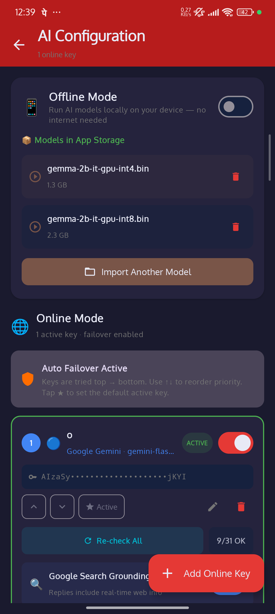
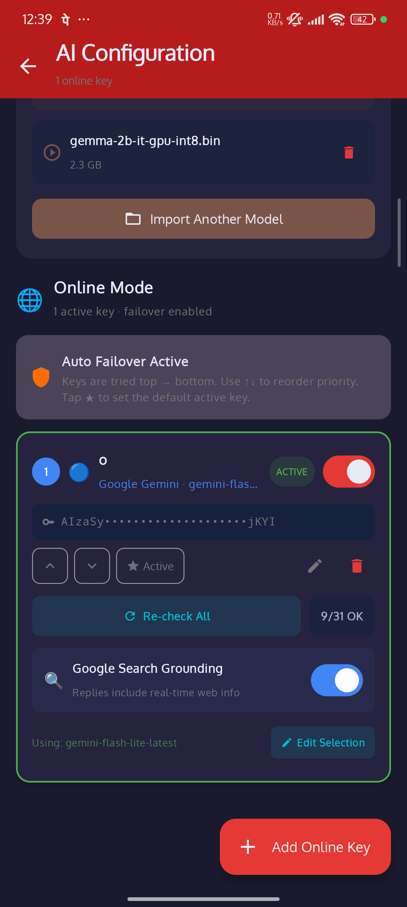

<div align="center">


# ZeroClaw Android

**A 24/7 AI agent daemon for Android — 11 messaging channels, 36 built-in AI tools, autonomous web scraper agents with scheduled delivery, interactive Tool Playground, advanced AI orchestration, vector memory, full infrastructure, polished configuration & UX, and NullClaw-inspired advanced features (Composio, MCP, A2A, MMR, hint routing, agent identity). Runs entirely on your phone.**

[](https://developer.android.com)
[](https://kotlinlang.org)
[](https://developer.android.com/compose)
[](LICENSE)

</div>

---

## 📖 What is ZeroClaw?

ZeroClaw is an **Android-native AI agent daemon** that turns your phone into an always-on AI backend. It runs as a foreground service across **11 messaging channels**, with **36 built-in AI tools**, an **Agents system** (autonomous web scraper agents that monitor URLs and push updates to Telegram/Discord/Slack on a schedule), an **interactive Tool Playground** to test and debug any tool live, **advanced AI orchestration** (streaming, multi-agent, delegate/spawn, workflows, thinking mode), **vector memory with RAG + MMR diversity**, a **complete infrastructure platform** (hooks, plugins, biometric lock, MCP client, A2A protocol, audit log), and a **NullClaw-inspired advanced layer** — Composio 1000+ app integrations, hint-based provider routing, agent identity (AIEOS v1.1), semantic cache, memory hygiene, and Pushover notifications.

No cloud subscription. No always-on PC. Just your Android device.

```
You → 11 messaging channels (Telegram / Slack / Matrix / Discord / Teams / ...)
              ↓
    ZeroClaw Service (background daemon)
              ↓
    NullClaw Layer: ProviderRouter (hints) → ComposioTool → McpClient → A2AServer
              ↓
    Config & UX: ThemeManager → RateLimiting → ApprovalSystem → ConversationLabels
              ↓
    Infrastructure: HooksSystem → PluginSystem → BiometricLock → AutoRecovery → AuditLog
              ↓
    Advanced AI: AgentIdentity → SystemPromptManager → MultiAgent+Delegate/Spawn → WorkflowEngine
              ↓
    Vector Memory: VectorMemory → HybridSearch+RRF → MMR Reranker → AdaptiveRetrieval → SemanticCache
              ↓
    Agents System: WebScraperAgent → AgentManager → scheduled delivery
              ↓
    Tool Playground: ToolPlaygroundScreen → ToolTestSheet → live test any tool
              ↓
    Tool System (36 tools) → LLM Router → Reply
```

---

## 📸 Screenshots

| Home | Settings | AI Configuration |
|------|----------|------------------|
|  |  |  |

| AI Config (Model Selection) | Info & Setup Guide |
|-----------------------------|-------------------|
|  |  |

---

## ✨ Features

### 🤖 Agents System (Phase 160)

#### Web Scraper Agent
- **Create autonomous agents** that monitor any URL on a schedule and push updates to your chosen channel
- **Supported delivery channels:** Telegram, Discord, Slack, WhatsApp, Email
- **Flexible intervals:** 15 min / 30 min / 1 h / 6 h / 12 h / 24 h (or custom, minimum 5 minutes)
- **AI extraction** — optional prompt sent to LlmRouter to extract insight from fetched page (e.g. "extract top 5 headlines")
- **Change detection** — hash-based: only pushes if page content actually changed (configurable toggle)
- **Run Now button** — trigger a fresh scrape instantly from the agent card to verify it's working
- **Test Fetch button** — test URL fetch from the create form before saving; shows 600-char preview or error inline
- **Telegram chatId validation** — real-time error if you accidentally paste a bot token instead of a chat ID
- Live status display on each agent card: last-run time, last delivery status, enabled/paused toggle
- 5-second polling loop refreshes the agent list so status updates appear immediately

### 🧪 Tool Playground & Testing

#### Tool Playground Screen
- **Interactive tool testing** — test any of the 36 built-in tools individually without sending a real message
- Per-tool enable/disable toggles, model selector (choose which LLM), category grid layout
- Every test run is logged to the Home Screen activity feed for visibility

#### Tool Test Sheet
- Bottom sheet form with custom argument fields per tool
- Image picker for ImageAnalysis tool testing
- Before/after logging via `ZeroClawService.log()` — results visible on Home Screen instantly

#### AI Tools Screen
- Browseable list of all 36 tools with enable/disable toggles, descriptions, and parameter details

#### Home Screen Log Improvements
- **Expandable LogCard** — "View all N / Show less" toggle when log entries exceed 20; playground tool runs highlighted in blue
- **DetailedLogCard** — second log panel showing full LLM call traces, tool results, web search steps
- **Copy buttons** — both Live Logs and Detailed Operation Log have a "Copy" button that copies all log text to clipboard with 2-second "Copied!" feedback
- **Larger log font** — detailed log entries at 12/13sp for better readability and screenshots

### 🛡️ Agent Reliability (Phase 164)

#### Chat ID Optional for Connected Channels
- When a channel (Telegram, Discord, Slack, WhatsApp) is already connected with a valid token, the Chat ID field becomes **optional** during agent creation
- Label shows "(optional)" and placeholder changes to "Optional — uses default bot chat"
- At delivery time, if chatId is blank, `WebScraperAgent` resolves it from `LlmRouter.getKnownChatIds()` (the most recent conversation for that channel)

#### Agent Extraction Pipeline
- **Problem:** `extractWithLlm()` called `router.call()` which triggered Pass 2 web search when the offline model couldn't extract from truncated content — resulted in irrelevant web scraping tutorial links instead of actual news headlines
- **Fix:** New `LlmRouter.extractOnly()` method that calls the model directly, bypassing Pass 2, tool enrichment, and chat history entirely
- Content increased from 600→2000 chars with RSS/XML boilerplate stripping (copyright notices, feed metadata) to maximize useful content within token budget

#### MediaPipe JNI Crash Prevention
- **Problem:** Clicking "Run Now" on an agent while the offline model was in use from another coroutine caused a JNI `nativeRemoveCallback` crash with "invalid global reference" — instant app death
- **Fix:** Added a `kotlinx.coroutines.sync.Mutex` to `OfflineModelManager` that serializes all `loadModel()` and `generateResponse()` calls, preventing concurrent JNI access
- If a JNI error is detected in the catch block, the engine is auto-destroyed so the next call can reload cleanly
- `WebScraperAgent.extractWithLlm()` now catches `Throwable` (not just `Exception`) to handle JNI `Error` types, falling back gracefully to raw content

### 🔧 Offline Model Intelligence (Phases 158-162)

#### Summarizer Refusal Fallback
- **Problem:** Small offline models (Gemma 2B) frequently respond with "the provided text doesn't mention..." even when fetched web data clearly contains the answer
- **Fix:** `isSummarizerRefusal()` detects 25+ refusal patterns including "not possible to answer", "doesn't mention", "available in the text", "has not occurred", "based on...the text...not"
- When detected, automatically falls back to `buildPassTwoDirectReply()` which formats web data directly — 100% accurate every time

#### Garbage Reply Detection
- **Problem:** Gemma 2B sometimes hallucinates random URL paths (e.g. an Iran war article URL when asked about anime)
- **Fix:** `isGarbageOfflineReply()` detects URL-dominated replies, URL-only responses, and short replies with zero keyword overlap with the user's query
- These garbage replies now trigger Pass 2 web data fetch instead of being sent to the user

#### Improved Summarizer Prompt
- Simplified from verbose "I have fetched the following information from the internet..." to direct "Below is real data... Do NOT say the data is missing — the answer IS in the data below"
- Small models respond significantly better to short, directive language

### ⚙️ Configuration & UX (Phases 131-140)

#### Phase 131 — ExportImportConfig
- **Full config backup** — export all API keys, channel credentials, system prompts, agent profiles, tool settings, and app preferences to a single encrypted JSON file
- **One-tap restore** — import the config file on a new device or after reinstall to instantly restore the full setup
- **Selective export** — choose which categories to include (keys only, channels only, full backup)
- Config files are AES-256 encrypted with a user-set passphrase before being written to storage
- Export shares via Android share sheet (save to Drive, send via email, etc.)

#### Phase 132 — ThemeManager
- **Custom color themes** — choose from 10 built-in Material You palettes or create a fully custom theme with your own primary/secondary/background colors
- **Dynamic color** — optionally follow Android 12+ wallpaper-based dynamic color
- **Dark / Light / System theme** — manual override independent of system setting
- Per-theme typography scale (compact, standard, large for accessibility)
- Theme preferences persist across app restarts; export/import includes theme config

#### Phase 133 — PerChannelPrompts UI
- **Dedicated UI** for configuring per-channel and per-user system prompts (exposes the Phase 110 SystemPromptManager through a first-class Settings screen)
- **Prompt editor** with syntax highlighting, variable picker (`{{username}}`, `{{channel}}`, `{{date}}`), and live character count
- **Template gallery** — browse and apply built-in prompt templates (Assistant, Coder, Analyst, Translator, Creative Writer)
- Per-channel prompts shown on the main Settings screen for quick discovery

#### Phase 134 — RateLimiting
- **Per-user rate limits** — configure maximum messages per user per time window (e.g., 10 messages/hour)
- **Per-channel limits** — set channel-wide throughput caps to prevent overload
- **Soft limits** — warn users when approaching their limit, hard-block when exceeded
- Rate limit state persists in Room DB; resets automatically at window expiry
- Admin users (configurable by user ID) are exempt from rate limits
- `/ratelimit status` command lets users check their remaining quota

#### Phase 135 — UsageTracking
- **Per-key usage stats** — tracks call count, token count, success rate, average latency, and last-used timestamp for every API key
- **Per-user stats** — message count and tool invocation count per user per channel
- **Usage dashboard** — new Settings screen showing charts for daily/weekly usage, top users, most-used tools
- Token cost estimation based on per-provider pricing tables (configurable)
- Data exported as CSV in the ExportImportConfig backup

#### Phase 136 — ApprovalSystem
- **Human-in-the-loop** — flag specific tool calls or LLM actions for manual approval before execution
- Configurable approval triggers: tools with side effects (Email, Calendar write, SmartHome), messages above a token threshold, or all actions in a high-security mode
- **Approval notifications** — pending approvals appear as Android notifications with Approve/Deny actions directly in the shade
- Approval decisions are logged with timestamp and approver identity
- Timeout behavior: auto-approve, auto-deny, or hold indefinitely (configurable)

#### Phase 137 — HomeWidget
- **Android home screen widget** — place on any launcher home screen
- Shows: service status (Running/Stopped), active channel count, last message timestamp, and total messages today
- **Quick actions** — Start/Stop service directly from the widget without opening the app
- Resizable: 2×1 (compact status only) and 4×2 (full stats + quick actions)
- Widget updates every 60 seconds via WorkManager

#### Phase 138 — VoiceInput
- **Voice-to-text input** in the WebChat channel — users can hold a microphone button and speak; message is transcribed via SpeechToText (Whisper) and sent as text
- **TTS playback toggle** — users can request AI responses to be read aloud via TextToSpeech in any channel that supports audio output
- Wake word detection (optional) — "Hey ZeroClaw" activates voice input in WebChat without pressing a button
- Voice input settings: language selection, Whisper model size, silence detection threshold

#### Phase 139 — ConversationLabels
- **Label any conversation** — tag conversations with colored labels (Work, Personal, Project X, Urgent, etc.)
- Labels stored per channel+userId; visible in a conversations list view in the app
- **Filter by label** — view all conversations with a specific label across channels
- **Auto-label rules** — keyword-triggered auto-labeling (e.g., messages containing "invoice" → label "Finance")
- Labels included in session summaries and searchable via the Memory tool

#### Phase 140 — GroupChatSupport
- **Telegram group support** — bot can be added to group chats and responds to @mentions or configured trigger words
- **Discord server channels** — responds to messages in any text channel the bot has access to, with optional `@ZeroClaw` mention requirement
- **Slack channel posting** — responds to messages in channels as well as DMs
- **Group context isolation** — per-group conversation history separate from private chat history
- **Admin commands** in groups: `/group prompt <text>` to set a group-specific system prompt; `/group ratelimit <n>` to set group-wide message limits
- **Thread awareness** — in Discord and Slack, replies are posted in-thread to keep group chats clean

### 🏗️ Infrastructure & Platform (Phases 123-130)
- **HooksSystem** — pre/post-message hook pipeline (filter, transform, notify, log)
- **PluginSystem** — user-installable sandboxed plugin packages (.zip import)
- **WebViewTool + MediaPipelineTool** — headless WebView scraping + media transcoding
- **RichNotifications + QuickReply** — rich Android notifications with reply-from-shade
- **BiometricLock** — fingerprint/face authentication guard with configurable timeout
- **DevicePairing** — multi-device mDNS discovery + encrypted config sync
- **AutoRecovery** — watchdog, crash reporter, circuit breaker, dead-letter queue
- **Platform hardening** — Doze awareness, exponential backoff, metrics endpoint

### 🔮 Vector Memory & RAG (Phases 118-122)
- **VectorMemory** — embedding-based semantic memory (OpenAI or local sentence-transformer)
- **HybridSearch + RRF** — BM25 + cosine similarity fused with Reciprocal Rank Fusion
- **QueryExpansion** — LLM query variants + HyDE for higher precision recall
- **TemporalDecay** — exponential memory freshness scoring with reinforcement
- **SessionManager** — session tracking, summaries, cross-session recall

### 🧠 Advanced AI Systems (Phases 110-117)
- **SystemPromptManager** — per-channel/user prompts with templates
- **StreamingResponse** — token-level streaming with typing indicators
- **MultiAgent** — pipeline orchestration (linear, fan-out, fan-in, conditional)
- **AgentProfiles** — named personas with per-profile tool/model config
- **WorkflowEngine** — visual multi-step workflow composer
- **ToolLoopDetector** — infinite loop prevention with auto-recovery
- **ThinkingMode** — extended reasoning (Claude extended thinking, OpenAI o1/o3)
- **ConversationSummarizer** — automatic context compression

### 🌐 API Server for External Apps (Port 8088)

ZeroClaw exposes an HTTP API server on port **8088** that any app can connect to and get full AI access — chat, tools, memory, agents, everything ZeroClaw can do.

#### Quick Connect — Any App in 30 Seconds

Any app that supports a **custom OpenAI base URL** can connect instantly:

| Setting | Value |
|---------|-------|
| **Base URL** | `http://<DEVICE_IP>:8088/v1` |
| **API Key** | `zc-no-key-needed` (any non-empty string works) |
| **Model** | `zeroclaw` |

That's it. The app now has access to all of ZeroClaw's capabilities: 36+ AI tools, web search, memory, image generation, code execution, and all configured LLM providers with automatic failover.

#### cURL — Test It Right Now

```bash
curl -X POST "http://<DEVICE_IP>:8088/v1/chat/completions" \
  -H "Content-Type: application/json" \
  -H "Authorization: Bearer zc-no-key-needed" \
  -d '{
  "model": "zeroclaw",
  "messages": [
    {"role": "system", "content": "You are a helpful AI assistant powered by ZeroClaw."},
    {"role": "user", "content": "Search the web for today'\''s top tech news and summarize them"}
  ],
  "max_tokens": 8192
}'
```

Replace `<DEVICE_IP>` with your phone's LAN IP (shown in the app under **Live Logs → Server Address**). If you have a tunnel (ngrok/Cloudflare), use the tunnel URL instead for access from anywhere.

#### All Endpoints

| Method | Endpoint | Format | Description |
|--------|----------|--------|-------------|
| `POST` | `/v1/chat/completions` | OpenAI-compatible | **Full AI agent pipeline** — tools, memory, chat history, thinking mode. Drop-in replacement for OpenAI API. |
| `GET` | `/v1/models` | OpenAI-compatible | Returns available models (zeroclaw). |
| `POST` | `/api/chat` | ZeroClaw native | Simple chat with session memory. |
| `POST` | `/api/generate` | ZeroClaw native | Raw LLM generation — no agent pipeline, no tools. |
| `GET` | `/api/discover` | ZeroClaw native | Service discovery — version, port, endpoints. |
| `GET` | `/` or `/chat` | HTML | Built-in web chat UI (open in browser). |

---

#### Endpoint 1: OpenAI-Compatible — `/v1/chat/completions` (Recommended)

**This is the recommended endpoint.** It speaks the standard OpenAI API format, so any app, library, or tool that works with OpenAI will work with ZeroClaw with zero code changes.

**Request:**
```json
POST /v1/chat/completions
{
  "model": "zeroclaw",
  "messages": [
    {"role": "system", "content": "You are a helpful assistant."},
    {"role": "user", "content": "What's the weather in Tokyo?"}
  ],
  "max_tokens": 8192
}
```
Headers: `Content-Type: application/json`, `Authorization: Bearer <any-string>`

**Response:**
```json
{
  "id": "chatcmpl-zc1719849600000",
  "object": "chat.completion",
  "created": 1719849600,
  "model": "zeroclaw",
  "choices": [{
    "index": 0,
    "message": {"role": "assistant", "content": "The current weather in Tokyo is 24°C, partly cloudy..."},
    "finish_reason": "stop"
  }],
  "usage": {"prompt_tokens": 25, "completion_tokens": 180, "total_tokens": 205}
}
```

**What happens behind the scenes:** ZeroClaw receives the message → detects it needs a weather tool → calls WeatherTool → gets live weather data → LLM formats the response → returns in OpenAI format. The calling app doesn't need to know any of this.

---

#### Endpoint 2: Chat API — `/api/chat`

Simple chat endpoint with session-based conversation memory.

**Request:**
```json
POST /api/chat
{"message": "Hello, who are you?", "session_id": "my_app_user_123"}
```

**Response:**
```json
{"reply": "I'm ZeroClaw, your AI assistant! I have access to 36+ tools including web search, weather, translation, image generation, and more. How can I help?"}
```

Each unique `session_id` maintains its own conversation history — the AI remembers previous messages in the same session.

---

#### Endpoint 3: Raw Generate — `/api/generate`

Direct LLM generation without the agent pipeline (no tools, no memory, no chat history). Use this when you need clean, predictable output.

**Request:**
```json
POST /api/generate
{
  "prompt": "List 10 anime similar to Naruto. Return ONLY a JSON array of objects with title and genre.",
  "json_mode": true,
  "max_tokens": 8192
}
```

**Response:**
```json
{"text": "[{\"title\": \"One Piece\", \"genre\": \"Action/Adventure\"}, ...]"}
```

Parameters:
- `prompt` (string, required) — The raw prompt
- `json_mode` (boolean, optional) — Forces JSON output format
- `max_tokens` (integer, optional, default 8192) — Maximum output tokens

---

#### Connect from Python

```python
# Using OpenAI SDK (recommended — works with any OpenAI-compatible library)
from openai import OpenAI

client = OpenAI(
    base_url="http://<DEVICE_IP>:8088/v1",
    api_key="zc-no-key-needed"
)

# Chat with full agent capabilities (web search, tools, memory)
response = client.chat.completions.create(
    model="zeroclaw",
    messages=[
        {"role": "system", "content": "You are a helpful AI assistant."},
        {"role": "user", "content": "Search the web for the latest Python 3.13 features"}
    ]
)
print(response.choices[0].message.content)

# --- OR using requests (simple chat) ---
import requests

r = requests.post("http://<DEVICE_IP>:8088/api/chat", json={
    "message": "What's 2+2?",
    "session_id": "python_app"
})
print(r.json()["reply"])
```

#### Connect from JavaScript / Node.js

```javascript
// Using OpenAI SDK
import OpenAI from 'openai';

const client = new OpenAI({
  baseURL: 'http://<DEVICE_IP>:8088/v1',
  apiKey: 'zc-no-key-needed'
});

const response = await client.chat.completions.create({
  model: 'zeroclaw',
  messages: [{ role: 'user', content: 'Translate "hello world" to Japanese, Spanish, and French' }]
});
console.log(response.choices[0].message.content);

// --- OR using fetch (simple chat) ---
const res = await fetch('http://<DEVICE_IP>:8088/api/chat', {
  method: 'POST',
  headers: { 'Content-Type': 'application/json' },
  body: JSON.stringify({ message: 'Hello!', session_id: 'js_app' })
});
const data = await res.json();
console.log(data.reply);
```

#### Connect from Any OpenAI-Compatible App

These apps/tools can connect to ZeroClaw by setting a custom base URL:

| App / Tool | Where to set Base URL |
|------------|----------------------|
| **Continue.dev** (VS Code AI) | `~/.continue/config.json` → `apiBase` |
| **Cursor** | Settings → Models → OpenAI API Base |
| **Open WebUI** | Admin → Connections → OpenAI API Base URL |
| **LangChain** | `ChatOpenAI(base_url="...")` |
| **LlamaIndex** | `OpenAI(api_base="...")` |
| **AutoGen** | `config_list` → `base_url` |
| **CrewAI** | `LLM(base_url="...")` |
| **Aider** | `--openai-api-base` flag |
| **Shell scripts** | `OPENAI_API_BASE` env var |
| **Any OpenAI SDK app** | Set `base_url` / `api_base` parameter |

#### Generate cURL from the App

In the ZeroClaw app: **Home Screen → Live Logs → Server Address → Generate cURL**. This generates ready-to-paste cURL commands with your device's actual IP/tunnel URL pre-filled. Includes tabs for OpenAI-compatible, Chat API, and Generate API formats with Python/JS code snippets.

#### Service Discovery — `/api/discover`
```json
GET /api/discover
// Response:
{
  "service": "zeroclaw",
  "version": "1.0",
  "port": 8088,
  "endpoints": ["/api/chat", "/api/generate", "/api/discover", "/v1/chat/completions", "/v1/models"]
}
```

#### What the Connected App Gets Access To

When any app connects to ZeroClaw via the API, it gets access to **everything** ZeroClaw can do:

- **36+ AI tools** — web search, weather, translate, image gen, calculator, RSS, QR codes, file manager, calendar, contacts, location, GitHub, Notion, email, Spotify, smart home, and more
- **Multi-provider LLM failover** — OpenAI, Gemini, Anthropic, OpenRouter (400+ models), Ollama, offline models — with automatic failover if one fails
- **Vector memory** — the AI remembers context across conversations (per session)
- **Thinking mode** — extended chain-of-thought reasoning for complex problems
- **Agent pipeline** — system prompts, tool auto-detection, multi-step tool chains
- **Conversation history** — per-session context maintained on the server side

The server starts automatically with the ZeroClaw service and is accessible on the device's LAN IP (e.g., `http://10.0.0.105:8088`). Use a tunnel (ngrok/Cloudflare) for public internet access.

### 💬 11 Messaging Channels (Phases 103-109)
- **Telegram** (+ group chat support via Phase 140)
- **WhatsApp** (Twilio)
- **Discord** (+ server channel support via Phase 140)
- **Signal**
- **Slack** (+ channel posting via Phase 140)
- **Matrix** — federated Matrix protocol client
- **IRC** — classic IRC bot via TCP socket
- **Microsoft Teams** — Bot Framework integration
- **Twitch** — Twitch Chat bot with !command support
- **LINE** — LINE Messaging API
- **WebChat** — built-in browser-accessible WebSocket chat (+ voice input via Phase 138)

### 🔧 AI Tools — 36 Built-in Tools

#### Core Tools (10)
Web Search (DuckDuckGo), Web Fetch, Memory (vector-backed), PDF Reader, Image Analysis, Cron/Scheduled Tasks, Status/Diagnostics, GitHub, Notion, Email

#### Extended Toolbox (18 — Phases 85-102)
Summarize, Translate (50+ languages), ImageGen (Pollinations + DALL-E), SpeechToText (Whisper), TextToSpeech (Android TTS), Calendar, Contacts, Location/Geocoding, Calculator, RSS, QR Code, FileManager, Clipboard, Spotify, SmartHome (Home Assistant), BraveTool, Bookmark

#### Infrastructure Tools (2 — Phase 125)
WebViewTool (headless JS-rendered scraping), MediaPipelineTool (media download + transcode)

#### NullClaw Tools (6 — Phases 141-151)
ComposioTool (1000+ app integrations), DelegateTool, SpawnTool, MessageTool (proactive messaging), McpClient, PushoverTool

### 🔑 Multi-Provider API Key Manager
- Unlimited keys, cURL import, live key testing, Gemini model picker
- Priority reordering, per-model selection, Set Active key, auto failover
- **Usage stats** per key (Phase 135) — call count, token usage, success rate

### 📱 Native Android UI (Material Design 3)
- Custom themes (Phase 132), export/import config (Phase 131)
- Home screen widget (Phase 137), biometric lock (Phase 127)
- Rich notifications with quick-reply (Phase 126)
- Usage dashboard, approval system, conversation labels

---

## 🏗️ Architecture

```
app/src/main/java/ai/zeroclaw/android/
│
├── MainActivity.kt
│
├── ui/
│   ├── HomeScreen.kt                    # Dashboard + expandable logs + DetailedLogCard
│   ├── ApiKeysScreen.kt                 # Key manager + per-key usage stats
│   ├── SettingsScreen.kt                # All settings inc. themes, prompts, rate limits
│   ├── InfoScreen.kt + InfoData.kt
│   ├── AgentsScreen.kt                  # Phase 160 — agent list, Run Now, live status
│   ├── AgentCreateSheet.kt              # Phase 160 — create/edit form with Test Fetch
│   ├── ToolPlaygroundScreen.kt          # Interactive tool testing + model selector
│   ├── ToolTestSheet.kt                 # Per-tool arg form + image picker + logging
│   ├── AiToolsScreen.kt                 # All-tools browse + enable/disable
│   ├── UsageDashboardScreen.kt          # Phase 135 — charts and stats
│   ├── ApprovalScreen.kt               # Phase 136 — pending approvals queue
│   ├── ConversationLabelsScreen.kt      # Phase 139 — label management
│   ├── PluginManagerScreen.kt           # Phase 124 — installed plugins
│   ├── DevicePairingScreen.kt           # Phase 128 — paired devices
│   └── theme/
│       └── ThemeManager.kt              # Phase 132 — custom color themes
│
├── data/
│   ├── ApiKeyEntry.kt, LlmKeyManager.kt, LlmRouter.kt
│   ├── OfflineModelManager.kt, AppSettings.kt
│   ├── MessageDatabase.kt, MemoryDatabase.kt
│   ├── UsageDatabase.kt                 # Phase 135 — per-key and per-user stats
│   └── LabelDatabase.kt                 # Phase 139 — conversation label store
│
├── config/                              # Phase 131-140
│   ├── ExportImportConfig.kt            # AES-encrypted full config backup/restore
│   ├── RateLimiter.kt                   # Per-user and per-channel rate limiting
│   ├── UsageTracker.kt                  # API call tracking and cost estimation
│   ├── ApprovalSystem.kt                # Human-in-the-loop action approval
│   ├── ConversationLabels.kt            # Label CRUD and auto-label rules
│   ├── HomeWidget.kt                    # Android AppWidgetProvider (2×1 + 4×2)
│   ├── VoiceInput.kt                    # WebChat voice-to-text + TTS playback
│   └── GroupChatSupport.kt              # Group context, @mention, admin commands
│
├── infra/                               # Phase 123-130
│   ├── HooksSystem.kt, PluginSystem.kt
│   ├── RichNotifications.kt, BiometricLock.kt
│   ├── DevicePairing.kt, AutoRecovery.kt
│   └── PlatformHardening.kt
│
├── memory/                              # Phase 118-122
│   ├── VectorMemory.kt, HybridSearch.kt
│   ├── QueryExpansion.kt, TemporalDecay.kt
│   └── SessionManager.kt
│
├── intelligence/                        # Phase 110-117
│   ├── SystemPromptManager.kt, StreamingResponse.kt
│   ├── MultiAgent.kt, AgentProfiles.kt
│   ├── WorkflowEngine.kt, ToolLoopDetector.kt
│   ├── ThinkingMode.kt, ConversationSummarizer.kt
│
├── agents/
│   ├── AgentConfig.kt                   # Phase 160 — agent data class
│   ├── AgentManager.kt                  # Phase 160 — CRUD + getDueAgents() + markRun()
│   └── WebScraperAgent.kt               # Phase 160 — fetch → extract → diff → deliver
│
├── tools/
│   ├── ToolSystem.kt
│   ├── [36 tool files — WebSearch through PushoverTool]
│
├── service/
│   ├── ZeroClawService.kt
│   └── BootReceiver.kt
│
├── telegram/, whatsapp/, discord/, signal/
├── slack/, matrix/, irc/, teams/, twitch/, line/, webchat/
└── tunnel/
    └── TunnelManager.kt
```

---

## 🚀 Getting Started

### Prerequisites
- Android Studio Hedgehog or newer
- Android device or emulator running **Android 8.0 (API 26)+**
- At least one LLM API key (OpenAI, Gemini, Anthropic, etc.)
- (Recommended) Android 12+ for Dynamic Color theming
- (Optional) OpenAI API key for high-quality embeddings

### Build & Run

```bash
git clone https://github.com/ashokvarmamatta/ZeroClawAndroid.git
cd ZeroClawAndroid
# Open in Android Studio → File → Open → ZeroClawAndroid
# Wait for Gradle sync, then click ▶ Run
```

### First-Time Setup

1. Tap **ℹ️** on the home screen for the full setup walkthrough
2. Go to **Settings → Manage API Keys** → **+ Add Online Key**
3. Add your LLM key and tap **Test Key**, then **Check All Models**
4. Select which models to use and optionally enable Google Search Grounding
5. Set your preferred **Theme** in Settings → Appearance
6. Configure **Per-Channel Prompts** for each messaging platform
7. Add channel credentials (Telegram token, Slack token, etc.)
8. (Optional) Enable **BiometricLock**, **Device Pairing**, and **Rate Limiting**
9. Add the **Home Screen Widget** from your launcher's widget picker
10. Tap **▶ Start** — the full ZeroClaw platform is now running

### Export / Restore Config

```bash
# In-app: Settings → Export Config → choose categories → set passphrase → share
# Restore: Settings → Import Config → select file → enter passphrase
```

### Using Group Chats

```
# Telegram group: add your bot, then:
@YourBot what's the weather today?

# Discord server: invite bot, then in any channel:
@ZeroClaw summarize this thread

# Admin commands (group admins only):
/group prompt You are a concise technical assistant for our engineering team.
/group ratelimit 20
```

---

## 🔑 Supported LLM Providers

| Provider | Auth | Default Base URL | Notes |
|---|---|---|---|
| **OpenAI** | Bearer | `https://api.openai.com/v1` | GPT-4o, o1, o3-mini; Whisper; DALL-E; embeddings |
| **Google Gemini** | API key | `https://generativelanguage.googleapis.com/v1beta` | Streaming, Google Search grounding, model picker |
| **Anthropic Claude** | x-api-key | `https://api.anthropic.com/v1` | Extended thinking (claude-3-7-sonnet) |
| **OpenRouter** | Bearer | `https://openrouter.ai/api/v1` | 400+ models from all providers |
| **Ollama** | None | `http://127.0.0.1:11434` | Local models on device |
| **Offline** | None | On-device | MediaPipe `.bin` models, no internet needed |
| **Custom endpoint** | Bearer | *(your Base URL)* | Modal, LiteLLM, vLLM, any OpenAI-compatible API |

---

## 📦 Tech Stack

| Layer | Technology |
|---|---|
| Language | Kotlin |
| UI | Jetpack Compose + Material Design 3 + Dynamic Color |
| Background | Android Foreground Service + WorkManager (watchdog + widget updates) |
| HTTP | OkHttp + Retrofit + SSE streaming |
| WebView | Android WebView (headless) |
| Storage | Room (messages + vectors + sessions + usage + labels) + DataStore |
| Vector Search | BM25 + cosine similarity + RRF (on-device) |
| Embeddings | OpenAI `text-embedding-3-small` / local sentence-transformer |
| Security | BiometricPrompt + AES-256-GCM (config export + device pairing) |
| Notifications | NotificationCompat + RemoteInput (quick-reply) |
| Widget | AppWidgetProvider + RemoteViews |
| Plugins | Custom ClassLoader sandbox |
| Serialization | Gson |
| Navigation | Jetpack Navigation Compose |
| Offline AI | MediaPipe LlmInference |
| Image Gen | Pollinations.ai (free) / DALL-E 3 |
| Speech | OpenAI Whisper (STT) + Android TTS + wake word detection |
| Messaging | 11 channel integrations |
| Tunnel | Cloudflare Tunnel / ngrok |

---

## 🛣️ Roadmap — Complete Feature Set

All phases are implemented on this branch.

### ✅ Agents System (Phase 160)
- [x] Web Scraper Agent — monitor any URL on a schedule ✅
- [x] AgentManager — SharedPreferences CRUD + due-agent polling ✅
- [x] AgentsScreen — agent list with summary banner, Run Now button ✅
- [x] AgentCreateSheet — create/edit form with Test Fetch button ✅
- [x] Delivery to Telegram / Discord / Slack / WhatsApp / Email ✅
- [x] AI extraction prompt — optional LlmRouter call per scrape cycle ✅
- [x] Change detection — skip push if content hash unchanged ✅
- [ ] RSS Monitor Agent (Phase 161 — planned)
- [ ] Price Tracker Agent (Phase 162 — planned)
- [ ] Social Feed Agent (Phase 163 — planned)

### ✅ Tool Playground & Testing
- [x] ToolPlaygroundScreen — test any of 36 tools live ✅
- [x] ToolTestSheet — per-tool arg form with image picker ✅
- [x] AiToolsScreen — browse and toggle all 36 tools ✅
- [x] Expandable LogCard — View all / Show less, blue-highlighted playground runs ✅
- [x] DetailedLogCard — full LLM trace logs below activity feed ✅
- [x] Copy button on Live Logs and Detailed Operation Log ✅
- [x] Larger font (12/13sp) for detailed log readability ✅

### ✅ Offline Model Intelligence (Phases 158-162)
- [x] isSummarizerRefusal() — detect "can't answer from context" replies, fall back to direct data ✅
- [x] isGarbageOfflineReply() — detect hallucinated URLs and irrelevant responses ✅
- [x] Improved summarizer prompt — directive language for small models ✅
- [x] Extended refusal patterns — "available in the text", "has not occurred", "no evidence" ✅

### ✅ Core Foundation
- [x] Multi-provider API key manager with unlimited keys ✅
- [x] cURL import mode ✅
- [x] Live key testing + Gemini model picker ✅
- [x] Per-model testing and selection ✅
- [x] Priority reordering and Set Active key ✅
- [x] Auto failover (waterfall) ✅
- [x] Google Search grounding (Gemini) ✅
- [x] Offline mode (MediaPipe `.bin` models) ✅
- [x] Live log viewer ✅
- [x] Cloudflare Tunnel / ngrok integration ✅
- [x] Starts on device reboot (BootReceiver) ✅
- [x] Native Material Design 3 UI ✅

### ✅ Core AI Tools (10 tools)
- [x] Web Search (DuckDuckGo) ✅
- [x] Web Fetch (URL + HTML extraction) ✅
- [x] Memory (persistent per-user, Room/SQLite) ✅
- [x] PDF Reader (local, URI, remote URL) ✅
- [x] Image Analysis (vision models) ✅
- [x] Cron / Scheduled Tasks ✅
- [x] Status / Diagnostics ✅
- [x] GitHub (search, READMEs, issues) ✅
- [x] Notion (search, read, create, append) ✅
- [x] Email (SendGrid / Mailgun) ✅

### ✅ Extended Toolbox — Phases 85-102 (18 tools)
- [x] SummarizeTool — extractive summarization ✅
- [x] TranslateTool — 50+ languages, MyMemory API ✅
- [x] ImageGenTool — Pollinations.ai + DALL-E 3 ✅
- [x] SpeechToTextTool — OpenAI Whisper transcription ✅
- [x] TextToSpeechTool — Android TTS engine ✅
- [x] CalendarTool — Android calendar events ✅
- [x] ContactsTool — Android contacts lookup ✅
- [x] LocationTool — GPS + reverse geocoding ✅
- [x] CalculatorTool — math expression evaluator ✅
- [x] RssTool — RSS/Atom feed fetcher ✅
- [x] QrCodeTool — QR generate + decode ✅
- [x] FileManagerTool — app storage file ops ✅
- [x] ClipboardTool — Android clipboard ✅
- [x] SpotifyTool — Spotify playback control ✅
- [x] SmartHomeTool — Home Assistant integration ✅
- [x] BraveTool — Brave Search API ✅
- [x] BookmarkTool — URL bookmark manager ✅

### ✅ Messaging Channels — Phases 103-109
- [x] Slack Bot (Events API) ✅
- [x] Matrix Bot (federated protocol) ✅
- [x] IRC Bot (TCP socket) ✅
- [x] Microsoft Teams Bot (Bot Framework) ✅
- [x] Twitch Chat Bot (IRC/TMI) ✅
- [x] LINE Bot (Messaging API) ✅
- [x] WebChat (built-in WebSocket server) ✅

### ✅ Advanced AI Systems — Phases 110-117
- [x] SystemPromptManager — per-channel/user prompts + templates ✅
- [x] StreamingResponse — token-level streaming + typing indicators ✅
- [x] MultiAgent — pipeline orchestration with handoff protocol ✅
- [x] AgentProfiles — named personas with tool/model config ✅
- [x] WorkflowEngine — visual multi-step workflow composer ✅
- [x] ToolLoopDetector — infinite loop prevention ✅
- [x] ThinkingMode — extended reasoning (Claude + o1/o3) ✅
- [x] ConversationSummarizer — auto context compression ✅

### ✅ Vector Memory & RAG — Phases 118-122
- [x] VectorMemory — embedding-based semantic store ✅
- [x] HybridSearch + RRF — BM25 + vector fusion ✅
- [x] QueryExpansion — LLM variants + HyDE ✅
- [x] TemporalDecay — exponential memory freshness ✅
- [x] SessionManager — session tracking + cross-session recall ✅

### ✅ Infrastructure & Platform — Phases 123-130
- [x] HooksSystem — pre/post-message pipeline ✅
- [x] PluginSystem — user-installable sandboxed plugins ✅
- [x] WebViewTool + MediaPipelineTool ✅
- [x] RichNotifications + QuickReply ✅
- [x] BiometricLock ✅
- [x] DevicePairing — multi-device mDNS + encrypted sync ✅
- [x] AutoRecovery — watchdog + crash reporter + circuit breaker ✅
- [x] Platform hardening — Doze, backoff, metrics endpoint ✅

### ✅ Configuration & UX — Phases 131-140
- [x] ExportImportConfig — AES-encrypted full config backup/restore ✅
- [x] ThemeManager — 10+ palettes, dark/light/system, dynamic color ✅
- [x] PerChannelPrompts UI — first-class prompt editor with template gallery ✅
- [x] RateLimiting — per-user and per-channel message rate limits ✅
- [x] UsageTracking — token usage, call stats, cost estimation, dashboard ✅
- [x] ApprovalSystem — human-in-the-loop with notification approve/deny ✅
- [x] ConversationLabels — colored labels, auto-label rules, cross-channel filter ✅
- [x] HomeWidget — launcher widget with service status + quick start/stop ✅
- [x] VoiceInput — WebChat mic input + TTS playback + wake word ✅
- [x] GroupChatSupport — Telegram/Discord/Slack groups with @mention + admin commands ✅

---

## 🚀 NullClaw-Inspired Advanced Features (Phases 141-157)

### Phase 141 — ComposioTool
- **1000+ OAuth app integrations** via Composio API v3/v2 — GitHub, Gmail, Jira, Notion, Salesforce, Slack, and 250+ more
- No per-app OAuth setup — Composio handles all authentication server-side
- Actions: `list_apps`, `list_actions` per app, `execute` any action with parameters
- Free tier: 100 actions/month. Disabled by default (requires Composio API key)

### Phase 142 — DelegateTool + SpawnTool
- **DelegateTool** — delegate a task to a named AI persona (coder, analyst, creative, tutor, brief) and wait for the result. Integrates with existing AgentProfileManager profiles
- **SpawnTool** — fire-off background agents asynchronously, get a `task_id` immediately. Collect results later with `spawn collect task_id=agent_1`
- Both restricted to depth=1 to prevent infinite agent chains
- Disabled by default — enable in Settings → AI Tools

### Phase 143 — MessageTool
- **Proactive messaging** — send messages to Telegram/Discord/Slack channels from cron jobs or agents without waiting for user input
- Perfect for: morning news digests, price alerts, scheduled summaries
- Uses `ZeroClawService.sendProactive()` to route through the connected channel manager
- Disabled by default — enable when you want agents to initiate conversations

### Phase 144 — McpClient (Model Context Protocol)
- **MCP JSON-RPC 2.0 HTTP client** — connect to any MCP server and auto-discover its tools
- Discovered tools appear as `mcp_{server}_{tool_name}` in the tool list
- Compatible with any MCP server: GitHub, filesystem, databases, APIs
- Disabled by default — requires MCP server URL in Settings → Advanced

### Phase 145 — MMR Reranker + Adaptive Retrieval
- **MmrReranker** — Maximal Marginal Relevance post-processing after RRF fusion. Filters redundant results using Jaccard token similarity so you get diverse, non-repetitive memory results
- **AdaptiveRetrieval** — auto-selects keyword-only (technical/short queries), vector-only (long natural language questions), or hybrid (default) based on query analysis
- No user action needed — both run automatically on every memory search

### Phase 146 — SemanticCache + MemoryHygiene
- **SemanticCache** — LRU response cache with 80% cosine similarity threshold. Avoids re-calling the LLM for semantically similar questions. Up to 100 entries, 30-minute TTL
- **MemoryHygiene** — WorkManager 12-hour periodic cycle: archives memories >7 days old, permanently purges archived memories >30 days old. Pinned memories are never deleted

### Phase 147 — Context Compaction (enhanced)
- Existing ConversationSummarizer enhanced with three modes: auto (75% threshold), force (drops messages, no LLM), trim (hard cap at 50 messages)

### Phase 148 — A2AServer (Agent-to-Agent Protocol)
- **Google A2A spec** implementation — exposes `GET /a2a/agent-card.json` (capabilities) and `POST /a2a` (JSON-RPC 2.0 task endpoint)
- Task state machine: `SUBMITTED → WORKING → COMPLETED/FAILED`
- Other AI agents can discover and delegate tasks to your ZeroClaw agent
- Disabled by default — requires Web Chat enabled

### Phase 149 — ProviderRouter (Hint-Based Routing)
- **Hint prefixes** route messages to the best provider for that task:
  - `hint:reasoning` → Claude Sonnet/Opus or o1
  - `hint:vision` → GPT-4o or Gemini Vision
  - `hint:fast` → Haiku or GPT-4o-mini
  - `hint:code` → Claude or GPT-4
  - `hint:creative` → GPT-4o or Claude Sonnet
  - `hint:long` → Gemini (long context)
- Per-model fallback chains (GPT-4o → GPT-4o-mini → GPT-3.5 etc.)

### Phase 150 — AgentIdentity (AIEOS v1.1)
- **Structured agent identity**: MBTI personality type, OCEAN big-five trait scores (0-100), catchphrases, forbidden words, core values, communication style
- Default: INTJ Mastermind — strategic, direct, precise
- Identity compiled into system prompt prefix for every LLM call

### Phase 151 — PushoverTool
- **Push notifications to any device** via Pushover API (iOS, Android, desktop)
- Priority levels: quiet (−1), normal (0), high (1), emergency (2, requires acknowledgment)
- Optional URL attachment, custom title
- Free tier: 10,000 messages/month. Disabled by default (requires Pushover token + user key)

### Phase 156 — AuditLog
- **Tamper-evident JSONL log** of every tool execution: timestamp, tool name, args, result summary, duration, and hash chain
- Daily log rotation, 30 days retained
- Enabled by default (passive, negligible overhead)

### Settings Redirect Buttons
- Every Settings section now has an **ⓘ info button** that opens the relevant Info guide tab
- No more guessing what a feature does — tap ⓘ to read a plain-language explanation before enabling

---

## ✅ NullClaw Features Checklist

- [x] ComposioTool — 1000+ app integrations ✅
- [x] DelegateTool — named agent delegation ✅
- [x] SpawnTool — async background agents ✅
- [x] MessageTool — proactive cross-channel messaging ✅
- [x] McpClient — MCP JSON-RPC 2.0 HTTP client ✅
- [x] MmrReranker — Jaccard diversity reranking ✅
- [x] AdaptiveRetrieval — auto keyword/vector/hybrid ✅
- [x] SemanticCache — LRU cosine similarity cache ✅
- [x] MemoryHygiene — 12h archive/purge WorkManager ✅
- [x] A2AServer — Google A2A agent protocol ✅
- [x] ProviderRouter — hint-based model routing ✅
- [x] AgentIdentity — AIEOS v1.1 MBTI/OCEAN ✅
- [x] PushoverTool — push notifications ✅
- [x] AuditLog — tamper-evident JSONL log ✅
- [x] Settings ⓘ redirect buttons to Info guide ✅
- [x] Offline summarizer refusal fallback (Phase 158) ✅
- [x] Garbage offline reply detection (Phase 159) ✅
- [x] Improved summarizer prompt for small models (Phase 161) ✅
- [x] Extended refusal pattern matching (Phase 162) ✅
- [x] Log UI copy buttons + larger font (Phase 163) ✅

---

## 🤝 Contributing

Contributions are welcome! Here's how to get started:

1. Fork the repo
2. Create a feature branch: `git checkout -b feature/my-feature`
3. Commit your changes: `git commit -m 'Add my feature'`
4. Push: `git push origin feature/my-feature`
5. Open a Pull Request

Please open an issue first for large changes so we can discuss the approach.

---

## 📄 License

This project is licensed under the MIT License — see the [LICENSE](LICENSE) file for details.

---

## 🙏 Acknowledgements

### Built on ZeroClaw
This Android app is built on top of the [**ZeroClaw**](https://github.com/zeroclaw-labs/zeroclaw) project by [ZeroClaw Labs](https://github.com/zeroclaw-labs). ZeroClaw Android extends it into a production-grade, fully self-hosted AI agent platform — 11 messaging channels, 36 AI tools, autonomous agents with scheduled delivery, interactive Tool Playground, advanced AI orchestration, vector memory with RAG, complete infrastructure platform, and polished configuration & UX. All running on your Android device.

### Libraries & Services
- [Telegram Bot API](https://core.telegram.org/bots/api) — [Twilio](https://www.twilio.com) — [Discord Gateway](https://discord.com/developers/docs/topics/gateway)
- [Slack API](https://api.slack.com) — [Matrix Spec](https://spec.matrix.org) — [Microsoft Bot Framework](https://dev.botframework.com)
- [Twitch TMI](https://dev.twitch.tv) — [LINE Messaging API](https://developers.line.biz)
- [OpenAI API](https://platform.openai.com) (GPT + Whisper + DALL-E + Embeddings)
- [Google Gemini API](https://ai.google.dev) — [Anthropic API](https://docs.anthropic.com)
- [OpenRouter](https://openrouter.ai) — [Ollama](https://ollama.com)
- [MediaPipe](https://ai.google.dev/edge/mediapipe/solutions/genai/llm_inference)
- [Pollinations.ai](https://pollinations.ai) — free AI image generation
- [Brave Search API](https://brave.com/search/api/) — [MyMemory Translation](https://mymemory.translated.net)
- [Composio](https://composio.dev) — 1000+ OAuth app integrations
- [Pushover](https://pushover.net) — push notifications API
- [Model Context Protocol](https://modelcontextprotocol.io) — MCP tool server standard
- [NullClaw](https://github.com/nullclaw/nullclaw) — advanced agent patterns (MMR, A2A, AIEOS, hint routing)
- [Cloudflare Tunnel](https://developers.cloudflare.com/cloudflare-one/connections/connect-networks/)
- [Android BiometricPrompt](https://developer.android.com/training/sign-in/biometric-auth)
- [WorkManager](https://developer.android.com/topic/libraries/architecture/workmanager)
- [Jetpack Compose](https://developer.android.com/compose) — [Material Design 3](https://m3.material.io)
- [Room](https://developer.android.com/training/data-storage/room) — [DataStore](https://developer.android.com/topic/libraries/architecture/datastore)
- [OkHttp](https://square.github.io/okhttp/) — [Retrofit](https://square.github.io/retrofit/)

---

<div align="center">
Made with ❤️ — built to run on your pocket supercomputer
</div>
